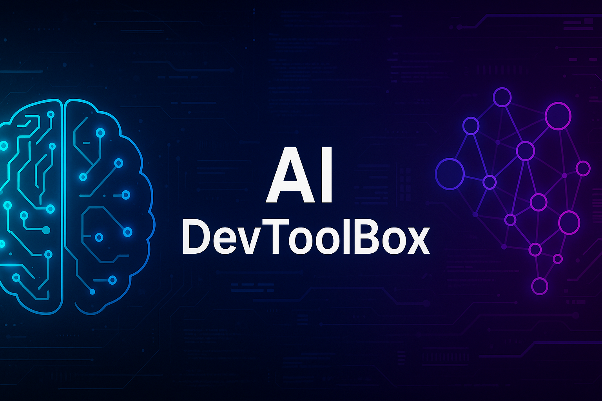

# 🧠 AI DevToolBox

> Modular Python toolkit to accelerate AI workflows — built for automation, scalability, and real-world usability.

---

## 🚀 Project Overview

**AI DevToolBox** is a modular Python toolbox built to streamline AI development workflows.  
It includes tools for debugging, natural language processing (NLP), data cleaning, vector database operations, and task automation.

This repo serves as both a usable toolkit and a professional showcase of Python architecture, modularity, and testing.

---

## 🔧 Key Features

- 🧠 **Text Processing** – Tokenization, lemmatization, stopword removal, and language detection  
- 🐞 **Smart Debugging** – AST-based error capture with trace logging and fix suggestions  
- 🧹 **Data Cleaning** – Null handling, whitespace trimming, deduplication  
- 🧭 **Vector Search** – Lightweight FAISS connector for similarity lookups  
- ⏱️ **Task Automation** – Decorator-based runner for function scheduling  

---

## 📦 Installation

Clone the repo and install dependencies:

```bash
git clone https://github.com/aiwithjusl/ai-dev-toolbox.git
cd ai-dev-toolbox
pip install -r requirements.txt

⚡ Quick Start

from devtoolbox.ai.ai_text_toolkit import AITextToolkit

toolkit = AITextToolkit()
tokens = toolkit.tokenize("This is a sample sentence.")
print(tokens)

⚙️ Requirements

nltk  
textblob  
langdetect  
pandas  
faiss-cpu

🧪 Run Tests

python3 -m unittest discover -s tests

📓 Notebook Demo

Explore features interactively in Google Colab or Jupyter:
📍 notebooks/AI_DevToolBox_Demo.ipynb

💡 Example Use Case: AI Prototyping

- Clean incoming datasets
- Debug pipeline issues on the fly
- Test search accuracy with vector embeddings
- Run NLP pipelines from a single interface
- Register + trigger workflow functions

🧰 Toolkit Modules

| Module               | Path                                      | Description                                                                      |
|----------------------|-------------------------------------------|----------------------------------------------------------------------------------|
| `ai_text_toolkit`    | devtoolbox/ai/ai_text_toolkit.py          | NLP utilities: tokenization, lemmatization, stopword removal, language detection |
| `ai_debugger`        | devtoolbox/core/ai_debugger.py            | Captures Python errors and suggests fixes using AST + trace logs                 |
| `dataset_cleaner`    | devtoolbox/data/dataset_cleaner.py        | Cleans data: handles nulls, trims whitespace, removes duplicates                 |
| `vector_db_connector`| devtoolbox/vector_db_connector.py         | FAISS-based vector search wrapper                                                |
| `task_runner`        | devtoolbox/tasking/task_runner.py         | Task scheduler with Python decorators                                            |

ai-dev-toolbox/
├── devtoolbox/
│   ├── ai/
│   ├── core/
│   ├── data/
│   ├── tasking/
│   ├── utils/
│   └── vector_db_connector.py
├── notebooks/
├── tests/
├── LICENSE
├── README.md
└── requirements.txt

👤 Author

Justin Lane 
🔗 GitHub: aiwithjusl (https://github.com/aiwithjusl)  
🔗 LinkedIn: Justin Lane (https://www.linkedin.com/in/justin-lane-69b960219)  
📬 Email: aiwithjusl.dev@gmail.com

🪄 License

MIT License – free for personal + commercial use
