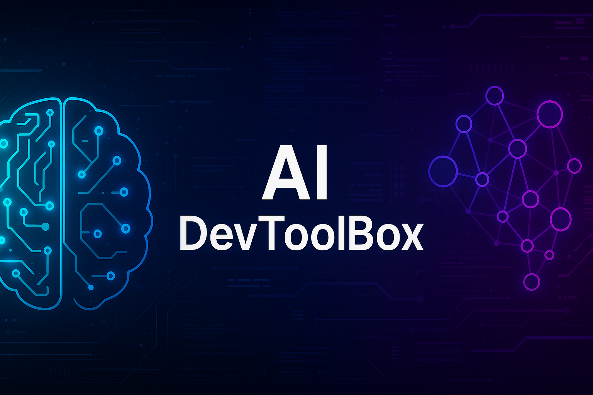

# 🧠 AI DevToolBox

*Modular Python toolkit to accelerate AI workflows — automation, NLP, debugging, data cleaning, vector search, and task automation.*

---

## 🚀 Features

- 🧠 **Text Processing** – Tokenization, lemmatization, stopword removal, and language detection  
- 🐞 **Smart Debugging** – AST-based error capture with trace logging and fix suggestions  
- 🧹 **Data Cleaning** – Null handling, whitespace trimming, deduplication  
- 🧭 **Vector Search** – Lightweight FAISS connector for similarity lookups  
- ⏱️ **Task Automation** – Decorator-based runner for function scheduling  

---

## 📦 Installation

```bash
git clone https://github.com/aiwithjusl/ai-dev-toolbox.git
cd ai-dev-toolbox
pip install -r requirements.txt

---

⚡ Quick Start

from devtoolbox.ai.ai_text_toolkit import AITextToolkit
from devtoolbox.core.ai_debugger import AIDebugger

# NLP Preprocessing
toolkit = AITextToolkit()
text = "Running tests with NLTK and FAISS is awesome!"
tokens = toolkit.tokenize(text)
lemmas = toolkit.lemmatize(tokens)
print("Tokens:", tokens)
print("Lemmas:", lemmas)

# Debugging a sample error
debugger = AIDebugger()
try:
    eval("x === y")  # Intentional syntax error
except Exception as e:
    debugger.debug(e)

---

⚙️ Requirements

- nltk

- textblob

- langdetect

- pandas

- faiss-cpu

---

🧪 Run Tests

python3 -m unittest discover -s tests


---

📓 Notebook Demo

Interactively explore features:
📍 notebooks/AI_DevToolBox_Demo.ipynb


---

💡 Example Use Case: AI Prototyping

Clean incoming datasets

Debug pipeline issues on the fly

Test search accuracy with vector embeddings

Run NLP pipelines from a single interface

Register + trigger workflow functions


---

🧰 Toolkit Modules

Module	Path	Description

ai_text_toolkit	devtoolbox/ai/ai_text_toolkit.py	NLP utilities: tokenization, lemmatization, stopword removal, language detection
ai_debugger	devtoolbox/core/ai_debugger.py	Captures Python errors and suggests fixes using AST + trace logs
dataset_cleaner	devtoolbox/data/dataset_cleaner.py	Cleans data: handles nulls, trims whitespace, removes duplicates
vector_db_connector	devtoolbox/vector_db_connector.py	FAISS-based vector search wrapper
task_runner	devtoolbox/tasking/task_runner.py	Task scheduler with Python decorators


---

```markdown
## 📂 Project Structure

```text
ai-dev-toolbox/
├── devtoolbox/
│   ├── ai/
│   ├── core/
│   ├── data/
│   ├── tasking/
│   ├── utils/
│   └── vector_db_connector.py
├── notebooks/
├── tests/
├── LICENSE
├── README.md
└── requirements.txt

---

## 👤 About the Author

**Justin Lane**  
🔗 GitHub: [@aiwithjusl](https://github.com/aiwithjusl)  
🔗 LinkedIn: [Justin Lane](https://www.linkedin.com/in/justin-lane-69b960219)  
📬 Email: aiwithjusl.dev@gmail.com

---

🪄 License

MIT License – free for personal + commercial use

---
